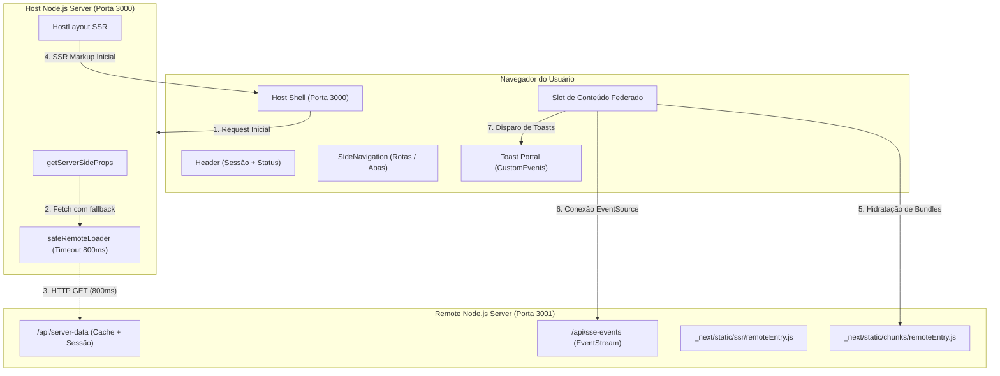

# Guia Definitivo: Arquitetura de Micro-Frontends com Next.js 15, Module Federation e SSR Resiliente

Este documento documenta a arquitetura, as decisões técnicas, a implementação dos 7 pilares da Prova de Conceito (PoC) e o histórico de resolução de problemas do projeto de **Micro-Frontends (MFE)** com **Next.js** e **Module Federation** (`@module-federation/nextjs-mf`).

---

## 1. Visão Geral da Arquitetura

O projeto é composto por dois micro-frontends executando em um monorepo gerenciado por **pnpm workspaces**:

1. **Host Shell (`apps/host` - Porta 3000)**:
   * Atua como a casca da aplicação (App Shell), contendo cabeçalho unificado, navegação lateral e portal de notificações globais.
   * Gerencia a autenticação/sessão do usuário e consome os módulos expostos pelo Remote tanto durante o ciclo de **Server-Side Rendering (SSR)** quanto na hidratação interativa no cliente.
   * Possui camada de tolerância a falhas (*fault-tolerance*): caso o Remote fique fora do ar ou apresente lentidão, o Host degrada graciosamente e responde sempre com `HTTP 200 OK`.

2. **Remote Provider (`apps/remote` - Porta 3001)**:
   * Expõe componentes visuais federados ([`ServerCard`](apps/remote/components/ServerCard.tsx), [`RemoteTelemetry`](apps/remote/components/RemoteTelemetry.tsx), [`RemoteMap`](apps/remote/components/RemoteMap.tsx), [`RemoteDashboard`](apps/remote/components/RemoteDashboard.tsx)).
   * Disponibiliza endpoint de streaming em tempo real via **Server-Sent Events (SSE)** em `/api/sse-events`.
   * Fornece dados de SSR com cabeçalhos de cache HTTP e cache em memória com TTL.



---

## 2. Estrutura do Monorepo

```
.
├── apps/
│   ├── host/                               # Host Application (Next.js 15 - Porta 3000)
│   │   ├── components/
│   │   │   ├── Header.tsx                  # Topo com perfil de sessão, status e botão de toast
│   │   │   ├── SideNavigation.tsx          # Menu lateral com rotas semânticas (?tab=...)
│   │   │   ├── ToastContainer.tsx          # Portal de notificações globais via CustomEvents
│   │   │   ├── HostLayout.tsx              # Layout unificado do Shell
│   │   │   ├── FederatedErrorBoundary.tsx  # Error Boundary para isolar falhas do Remote
│   │   │   └── RemoteFallbackCard.tsx      # Card de degradação graciosa quando Remote está offline
│   │   ├── lib/
│   │   │   ├── events.ts                   # Despachante e constantes de eventos globais
│   │   │   ├── session.ts                  # Perfis de sessão pré-definidos e persistência
│   │   │   └── safeRemoteLoader.ts         # Fetch com timeout estrito (800ms) e header de sessão
│   │   ├── pages/
│   │   │   ├── index.tsx                   # Página principal com SSR e hidratação federada
│   │   │   ├── 404.tsx & 500.tsx           # Páginas de fallback de status
│   │   │   └── _app.tsx
│   │   ├── public/
│   │   │   └── favicon.ico                 # Ícone da aplicação (HTTP 200)
│   │   ├── styles/globals.css              # Estilos do App Shell, Sidebar, Mapas e Toasts
│   │   ├── declarations.d.ts               # Tipagens TypeScript para módulos de 'remote/*'
│   │   └── next.config.js                  # NextFederationPlugin configurado como Host
│   │
│   └── remote/                             # Remote Application (Next.js 15 - Porta 3001)
│       ├── components/
│       │   ├── ServerCard.tsx              # Componente federado com métricas e sessão herdada
│       │   ├── RemoteTelemetry.tsx         # Consumidor de SSE com reconexão e controle de stream
│       │   ├── RemoteMap.tsx               # Mapa interativo com MapLibre GL e marcadores de frota
│       │   └── RemoteDashboard.tsx         # Container federado integrado por abas
│       ├── lib/
│       │   ├── cache.ts                    # Gerenciador de cache em memória com TTL
│       │   ├── events.ts                   # Emissor de eventos globais para o Host
│       │   └── getServerData.ts            # Provedor de diagnóstico SSR e herança de sessão
│       ├── pages/
│       │   ├── api/
│       │   │   ├── server-data.ts          # Endpoint HTTP para dados de SSR com cabeçalhos de cache
│       │   │   └── sse-events.ts           # Endpoint text/event-stream de telemetria contínua
│       │   ├── index.tsx                   # Visualização standalone da Remote na porta 3001
│       │   ├── 404.tsx & 500.tsx
│       │   └── _app.tsx
│       ├── public/
│       │   └── favicon.ico
│       ├── styles/globals.css              # Estilos dos componentes federados e pins
│       ├── types/index.ts                  # Interfaces TypeScript compartilhadas
│       └── next.config.js                  # NextFederationPlugin expondo os 6 módulos
│
├── scripts/
│   ├── verify-poc.mjs                      # Validação automatizada de todos os 7 critérios da PoC
│   ├── verify-ssr.mjs                      # Validação de SSR no HTML bruto
│   └── verify-resilience.mjs               # Validação de tolerância a falhas (Remote Offline)
├── pnpm-workspace.yaml                     # Configuração de workspaces e pinagem
└── package.json                            # Scripts de orquestração (dev, build, start, test)
```

---

## 3. Os 7 Pilares da Prova de Conceito (PoC)

| # | Requisito | Como foi Implementado |
| --- | --- | --- |
| **1** | **Sessão no Host e Herança pelo Remote** | O Host gerencia o estado da sessão (`UserSession`) com seletor de perfis (Admin, Operator, Viewer). No SSR, o Host encaminha a sessão via header `x-user-session` para o Remote, que a injeta nas propriedades do componente federado. No cliente, mudanças de sessão são emitidas via `mfe:session-change`. |
| **2** | **Remote como Seção Interna do Host** | O `HostLayout` provê um cabeçalho fixo (`Header`) e barra de navegação lateral (`SideNavigation`), renderizando o micro-frontend remoto dentro do slot principal de conteúdo, envelopado por `Suspense` e `FederatedErrorBoundary`. |
| **3** | **Conexões SSE (Server-Sent Events)** | A aplicação Remote possui o endpoint `/api/sse-events` transmitindo pacotes de telemetria e alertas contínuos. O componente `RemoteTelemetry` abre a conexão via `EventSource`, gerencia reconexão automática, controles de pausa/retomada e executa `es.close()` no unmount. |
| **4** | **Server-Side Rendering (SSR)** | A integração via `@module-federation/nextjs-mf` renderiza a árvore de componentes do Remote durante o `getServerSideProps` do Host. O markup final é enviado completo no HTML inicial, sem flash de carregamento ou waterfall. |
| **5** | **Estados Globais e Cache** | *Estados Globais*: Sistema de Toasts desacoplado operando através do padrão Event Bus com `CustomEvent('mfe:toast')`. O Remote dispara toasts que o Host renderiza no portal flutuante.<br>*Cache*: Endpoint `/api/server-data` utiliza cabeçalho `Cache-Control: public, s-maxage=5, stale-while-revalidate=10` e store em memória com TTL. |
| **6** | **Query Params e Roteamento** | A navegação lateral e os controles de filtro utilizam sincronização de query params (`?tab=overview`, `?tab=telemetry`, `?tab=map`, `?tab=metrics`, `?city=sao-paulo`) utilizando History API e estado local, evitando recarregamentos totais de página. |
| **7** | **Remote MFE com MapLibre GL** | O componente `RemoteMap` carrega dinamicamente a biblioteca `maplibre-gl` no cliente, renderiza tiles OpenStreetMap, adiciona marcadores de nós de infraestrutura com popups e dispara notificações de toast ao selecionar locais. |

---

## 4. Histórico de Problemas Enfrentados e Soluções Aplicadas

### Desafio 1: Permissões de Scripts no pnpm v11

* **Sintoma**: `pnpm install` ignorava scripts de pós-instalação exigidos pelo `@module-federation/nextjs-mf`.
* **Solução**: Criação do arquivo `.npmrc` na raiz com `enable-pre-post-scripts=true`.

### Desafio 2: Webpack Interno vs. Local do Next.js

* **Sintoma**: Incompatibilidade entre o Webpack embutido do Next.js 15 e a compilação do plugin de federação.
* **Solução**: Adicionada a flag `NEXT_PRIVATE_LOCAL_WEBPACK=true` nos scripts de `dev` e `build` em ambos os `package.json`.

### Desafio 3: Resiliência a Falhas no SSR (Timeout e Degradação Graciosa)

* **Sintoma**: Se a Remote ficasse offline, a resolução padrão do Module Federation no servidor causava travamento ou erro 500 no Host.
* **Solução**: Implementação do utilitário `safeRemoteLoader.ts` com requisição HTTP direta, timeout de 800ms e retorno de `null` controlado, fazendo o Host renderizar o `RemoteFallbackCard` com código `HTTP 200 OK`.

### Desafio 4: Paridade de Tags DOM para Evitar Hydration Mismatch

* **Sintoma**: Erros de hidratação no React 18/19 quando a estrutura de tags do componente renderizado diferia da estrutura do fallback.
* **Solução**: Unificação de tags semânticas `<div className="federated-card">` e `<header className="federated-card-header">` em todos os estados de renderização.

### Desafio 5: Erro "NextRouter was not mounted" em Componentes Federados

* **Sintoma**: Invocação de `useRouter()` dentro de componentes antes da montagem completa do `RouterContext` do Next.js disparava exceções de cliente e erro minificado `#423`.
* **Solução**: Remoção da dependência direta de `useRouter` nos componentes de navegação; substituição por âncoras semânticas `<a>` e propagação de `initialTab`/`initialRoute` a partir do `getServerSideProps`.

### Desafio 6: Erro de Serialização JSON de `undefined` no `getServerSideProps`

* **Sintoma**: O Next.js rejeita propriedades contendo `undefined` com o erro *`Reason: undefined cannot be serialized as JSON. Please use null or omit this value.`*
* **Solução**: Sanitização de todas as propriedades opcionais do servidor (`initialFilter`, `initialCity`, `serverData.session`, `errorReason`) para utilizarem `null` explicitamente.

### Desafio 7: Isolamento de Renderização WebGL do MapLibre no SSR

* **Sintoma**: Tentativas de acessar `window` ou instanciar WebGL durante o SSR provocavam quebra de build e de servidor.
* **Solução**: Importação dinâmica de `maplibre-gl` protegida dentro do hook `useEffect` no cliente, com exibição de overlay de carregamento elegante durante a renderização no servidor.

---

## 5. Guia de Execução e Verificação

### 1. Instalação e Compilação

```bash
# Instalar dependências
pnpm install

# Verificar tipagem TypeScript
pnpm typecheck

# Compilar ambas as aplicações para produção
pnpm build
```

### 2. Execução dos Servidores

```bash
# Iniciar Host (3000) e Remote (3001) em paralelo
pnpm start

# Ou iniciar individualmente:
pnpm start:remote   # Porta 3001
pnpm start:host     # Porta 3000
```

### 3. Suíte de Testes Automatizados

```bash
# 1. Validação Completa da PoC (Todos os 7 Requisitos)
pnpm verify:poc

# 2. Validação do Server-Side Rendering (Markup no HTML Bruto)
pnpm verify:ssr

# 3. Validação de Resiliência e Modo Degradado (Remote Offline)
pnpm verify:resilience
```

---

## 6. Conclusão

A arquitetura desenvolvida comprova a viabilidade técnica de uma solução corporativa de **Micro-Frontends com Next.js 15 e Module Federation**.

Os componentes remotos operam como ilhas dinâmicas isoladas, herdando a identidade e o contexto do Host, comunicando-se por barramento de eventos desacoplado e mantendo alta disponibilidade mesmo diante de falhas completas nos serviços remotos.
