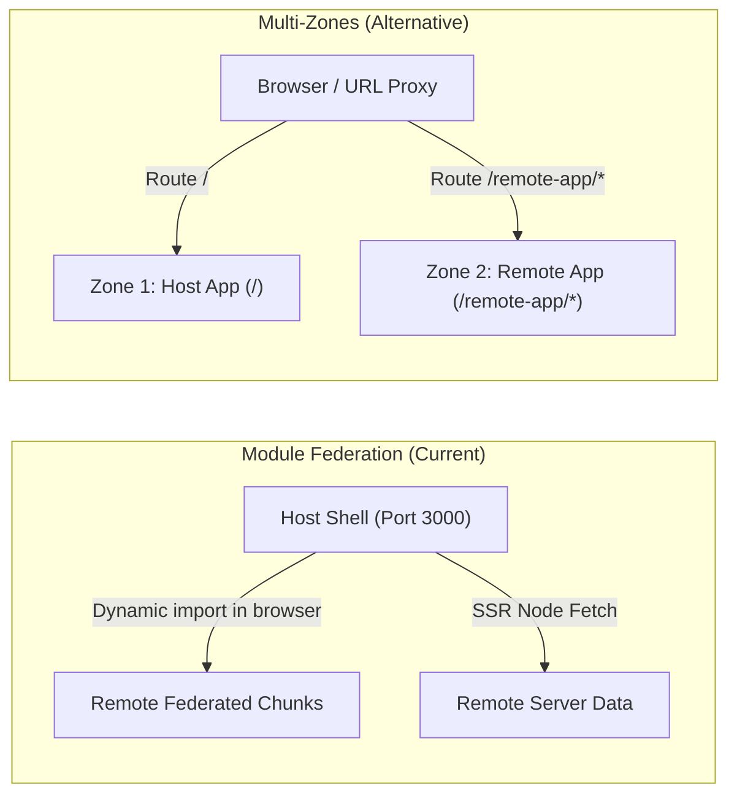

# Next.js Multi-Zones Architecture: Overview, Feasibility Research & Migration Analysis

## 1. Executive Summary

This document presents a comprehensive technical research and feasibility analysis comparing the current **Module Federation (MF)** architecture (`@module-federation/nextjs-mf`) with a native **Next.js Multi-Zones** architecture for the Enterprise Micro-Frontend (MFE) PoC.

### Key Finding: Is the Same Result Expected?
**No, the runtime behavior and user experience are fundamentally different:**
- **Module Federation (Current)** provides **Component-Level Composition** (Micro-Apps / Islands). The Host Shell renders a persistent layout (Header, Sidebar, Toast Portal), and embeds the Remote’s visual components directly into its React tree without page reloads.
- **Multi-Zones (Alternative)** provides **Route/Path-Level Segmentation** (Micro-Sites). Each zone is an independent Next.js application responsible for its own entire document lifecycle (HTML `<html>`, `<head>`, `<body>`). Navigating between zones triggers a **hard page navigation (MPA behavior)** rather than client-side soft transitions.

---

## 2. Direct Comparison: The 7 PoC Pillars

| PoC Pillar | Current Architecture (Module Federation) | Multi-Zones Architecture | Feasibility & Trade-offs in Multi-Zones |
| :--- | :--- | :--- | :--- |
| **1. Session Sharing** | Session state passed via React props & in-memory store directly to federated components. | Shared via **HTTP Cookies** (`Domain=...; SameSite=Lax`) or `localStorage`. | **High**: Natural web standard. No prop drilling across bundles, but requires cookie management or JWT middleware. |
| **2. Remote Embedded in Host Shell** | Remote components render *inside* Host's `<HostLayout>` slots dynamically. | **Not possible out-of-the-box**. Each zone renders its own full page. | **Requires Workaround**: Shell layout must be extracted into a shared workspace package (`@mfe/ui-shell`) imported by both apps, or embedded via `<iframe>` / Web Components. |
| **3. SSE Real-time Telemetry** | Stream lives in the same DOM session; persists across tab switches if layout doesn't unmount. | Stream lives on Zone B's page. Navigating back to Zone A terminates the EventSource connection. | **Medium**: Works on Zone B routes. If Host rewrites proxy SSE, buffering must be disabled (`X-Accel-Buffering: no`). |
| **4. Server-Side Rendering (SSR)** | Host calls Remote API / SSR chunks via `safeRemoteLoader` during Host SSR. | **Native & Isolated**. Zone A server renders Zone A pages; Zone B server renders Zone B pages. | **Very High**: Simpler, faster, zero custom SSR federation loaders or timeout guards needed. |
| **5. Global State & Toasts** | `window.CustomEvent` and in-memory stores work instantly across MFEs in the same tab. | `window` is destroyed on zone transition. Cross-zone state cannot survive in-memory. | **Requires Workaround**: Toasts must use `BroadcastChannel` (for cross-tab) or sessionStorage/URL params for flash messages across navigation. |
| **6. Route & Query Params** | Host controls URL history (`pushState` / Next Router), passing query params to Remote. | Native path routes (`/` vs `/fleet/map`, `/fleet/telemetry`) and Next.js query parsing. | **High**: Standard Next.js routing, cleaner URL structure, native deep-linking. |
| **7. MapLibre GL Integration** | Dynamically loaded client-side island inside federated card. | Standard client component with `next/dynamic` (`ssr: false`) inside Zone B. | **High**: Better build isolation, avoids Webpack 5 shared canvas/singleton issues. |

---

## 3. Required Architectural & Code Changes

If converting this repository from Module Federation to Multi-Zones, the following changes would be necessary:

```
nextjs-mfe/
├── packages/
│   └── ui-shell/              # [NEW] Shared Shell layout (Header, Nav, CSS, Session Provider)
├── apps/
│   ├── host/                  # Zone 1 (Root Zone: Port 3000 -> '/')
│   │   ├── next.config.js     # Rewrites to Zone 2 (/remote-app/:path*)
│   │   └── pages/
│   └── remote/                # Zone 2 (Sub-Zone: Port 3001 -> '/remote-app')
│       ├── next.config.js     # basePath: '/remote-app', assetPrefix: '/remote-app'
│       └── pages/
```

### 3.1. Routing & Proxy Configuration (`next.config.js`)

#### Host Zone (`apps/host/next.config.js`)
The host acts as the entry point reverse-proxying requests matching `/remote-app/:path*` to the remote server:

```javascript
// apps/host/next.config.js
/** @type {import('next').NextConfig} */
const nextConfig = {
  async rewrites() {
    return [
      {
        source: '/remote-app',
        destination: `${process.env.REMOTE_ZONE_URL || 'http://localhost:3001'}/remote-app`,
      },
      {
        source: '/remote-app/:path*',
        destination: `${process.env.REMOTE_ZONE_URL || 'http://localhost:3001'}/remote-app/:path*`,
      },
      // Proxy static assets so host can serve remote chunks
      {
        source: '/remote-app/_next/:path*',
        destination: `${process.env.REMOTE_ZONE_URL || 'http://localhost:3001'}/remote-app/_next/:path*`,
      },
    ];
  },
};

module.exports = nextConfig;
```

#### Remote Zone (`apps/remote/next.config.js`)
The remote must configure `basePath` and `assetPrefix` to prevent asset path collisions on `/_next/`:

```javascript
// apps/remote/next.config.js
/** @type {import('next').NextConfig} */
const nextConfig = {
  basePath: '/remote-app',
  assetPrefix: '/remote-app',
};

module.exports = nextConfig;
```

---

### 3.2. Replacing Federated Components with Shared Layout Package

In Module Federation, `apps/host` mounts `<RemoteDashboard />` directly. In Multi-Zones, each zone has its own HTML root. To preserve visual unity:

1. **Extract UI Shell**: Move `Header`, `SideNavigation`, `ToastContainer`, and design tokens into `packages/ui-shell`.
2. **Import Shell in Both Apps**:
   - `apps/host/pages/_app.tsx` wraps with `<AppShell currentZone="host">`
   - `apps/remote/pages/_app.tsx` wraps with `<AppShell currentZone="remote">`
3. **Cross-Zone Links**:
   - Intra-zone navigation uses `<Link href="/overview">` (Fast client-side transition).
   - Cross-zone navigation uses standard `<a href="/remote-app/fleet">` (Triggers browser navigation to the other zone).

---

### 3.3. Communication & Logging Adaptation

| Mechanism | Module Federation (Current) | Multi-Zones Migration |
| :--- | :--- | :--- |
| **Server-to-Server SSR** | Node HTTP fetch (`safeRemoteLoader`) with 800ms timeout | Eliminated. Remote zone directly executes its own SSR on incoming browser requests. |
| **Client Event Bus** | `window.dispatchEvent(CustomEvent)` | Replaced with **Cookies/Storage events** or **BroadcastChannel API** for cross-tab/window syncing. |
| **Server Logs (stdout)** | Host logs outgoing fetch + Remote logs incoming handler | Zone A server logs Zone A requests; Zone B server logs Zone B requests independently. |
| **Browser Console Logs** | Tagged logs coexist in one active DevTools session | Logs refresh on zone transition as new document loads. |

---

## 4. Architectural Trade-offs Matrix



### Advantages of Multi-Zones over Module Federation:
1. **Zero Webpack Federation Hackery**: Works natively with Next.js 15, Turbopack, and standard Next.js updates without plugin version breakage.
2. **Complete Fault Isolation**: If Zone 2 crashes or throws a fatal error, Zone 1 is 100% unaffected.
3. **Independent Deployments & Pipelines**: Deploying Zone 2 requires zero coordination with Zone 1 runtime bundles.
4. **Clean SSR Performance**: No server-to-server microservice latency chaining inside `getServerSideProps`.

### Disadvantages of Multi-Zones:
1. **Hard Page Transitions**: Moving from Host view to Remote view reloads HTML, resets in-memory client state, and re-executes `<head>` scripts.
2. **Duplicated Shell Assets**: Both applications download React, Next runtime, and UI shell CSS chunks independently.
3. **Cannot Compose Widgets/Micro-Cards**: Cannot render a Remote widget inside a Host page without iframes or server-side includes.

---

## 5. Summary & Recommendation

| Use Case | Recommended Architecture |
| :--- | :--- |
| **Single Portal / Unified Dashboard** with embedded widgets, persistent music/video/chat streams, and seamless tab transitions. | **Module Federation** *(Current PoC)* |
| **Distinct Large Sub-Domains / Apps** (e.g., `/shop`, `/blog`, `/admin`, `/checkout`) managed by separate autonomous squads. | **Next.js Multi-Zones** |
